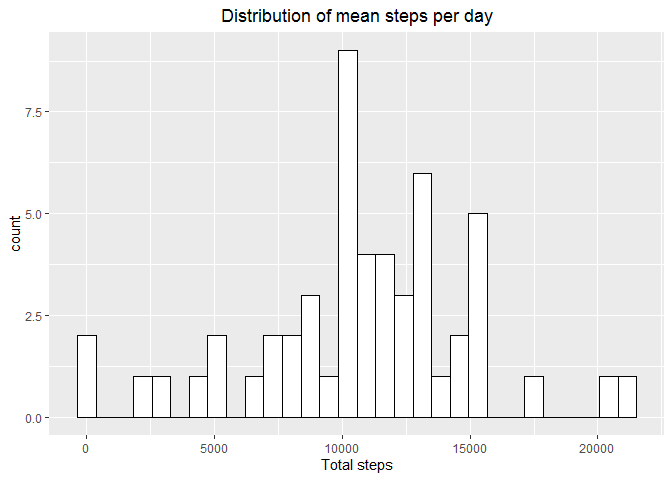
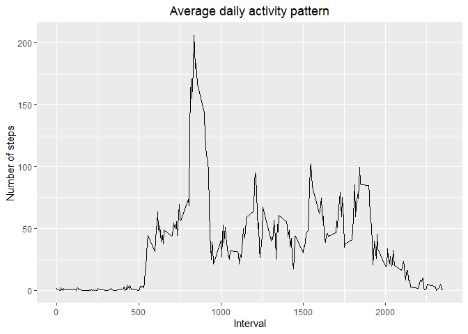
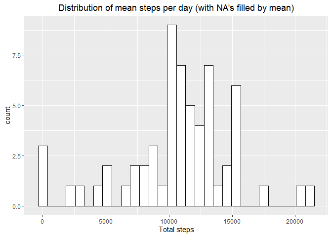
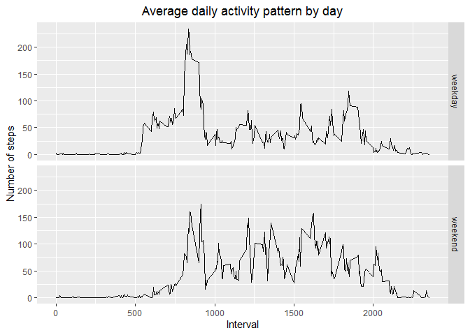
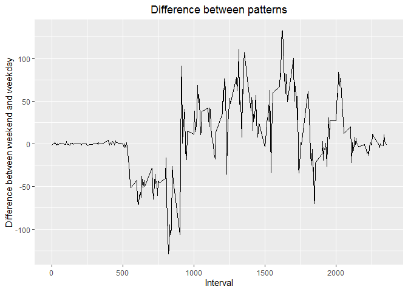

## Loading and preprocessing the data
In this case I've used libraries **ggplot2** and **dplyr**.

```r
library(ggplot2)
library(dplyr)
```
Here's the unprepared data.

```r
dataFile <- 'activity.zip'
unzip(dataFile)
#just because we know the file extension, we can use grep
activities <- read.csv(list.files()[grep('.csv', list.files())]) %>%
  mutate(day = ifelse(strftime(date, '%w') %in% c(0, 6), 'weekend', 'weekday'))
```
Remove NA's to make calculating average more simple

```r
completeActivities <- activities[complete.cases(activities$steps), ]
```

For counting total number of steps taken per day

```r
dailyTotal <- aggregate(activities$steps, by = list(activities$date), FUN = sum)
names(dailyTotal) <- c('date', 'total.steps')
```

For counting average number of steps by period divided into weekday and weekend

```r
dailyMean <- aggregate(completeActivities$steps, by = list(completeActivities$interval,
                                                         completeActivities$day), FUN = mean)
names(dailyMean) <- c('interval', 'day', 'mean.steps')
```

Data for plotting average daily activity pattern

```r
intervalMean <- aggregate(completeActivities$steps, 
                          by = list(completeActivities$interval), FUN = mean)
names(intervalMean) <- c('interval', 'mean.steps')
```

Finding average daily with NA's replaced by mean

```r
filled <- activities
filled$steps[is.na(filled$steps)] <-
  with(filled, ave(steps, interval,
                   FUN = function(x) replace(x, is.na(x), mean(x, na.rm = T))))
dailyTotalFilled <- aggregate(filled$steps, by = list(filled$date), FUN = sum)
names(dailyTotalFilled) <- c('date', 'total.steps')
```
## What is mean total number of steps taken per day?

```r
plot1 <- ggplot(dailyTotal, aes(x = total.steps)) +
  geom_histogram(color = 'black', fill = 'white') +
  xlab('Total steps') +
  ggtitle('Distribution of mean steps per day') +
  theme(plot.title = element_text(hjust = 0.5))
print(plot1)
```

<!-- -->

Mean steps per day

```r
print(mean(dailyTotal$total.steps, na.rm = TRUE))
```

```
## [1] 10766.19
```

Median steps per day

```r
print(median(dailyTotal$total.steps, na.rm = TRUE))
```

```
## [1] 10765
```

## What is the average daily activity pattern?

```r
plot2 <- ggplot(intervalMean, aes(x = interval, y = mean.steps)) +
  geom_line() +
  xlab('Interval') +
  ylab('Number of steps') +
  ggtitle('Average daily activity pattern') +
  theme(plot.title = element_text(hjust = 0.5))
print(plot2)
```

<!-- -->

Which 5-minute interval, on average across all the days in the dataset, contains the maximum number of steps?

```r
print(intervalMean$interval[which.max(intervalMean$mean.steps)])
```

```
## [1] 835
```

## Imputing missing values
Total number of missing values in the dataset

```r
print(sum(is.na(activities)))
```

```
## [1] 2304
```


```r
plot3 <- ggplot(dailyTotalFilled, aes(x = total.steps)) +
  geom_histogram(color = 'black', fill = 'white') +
  xlab('Total steps') +
  ggtitle("Distribution of mean steps per day (with NA's filled by mean)") +
  theme(plot.title = element_text(hjust = 0.5))
print(plot3)
```

<!-- -->

Median steps per day (with NA's replaced)

```r
print(mean(dailyTotalFilled$total.steps))
```

```
## [1] 10745.3
```

Median steps per day (with NA's replaced)

```r
print(median(dailyTotalFilled$total.steps))
```

```
## [1] 11015
```

## Are there differences in activity patterns between weekdays and weekends?

```r
plot4 <- ggplot(dailyMean, aes(x = interval, y = mean.steps)) +
  geom_line() +
  xlab('Interval') +
  ylab('Number of steps') +
  facet_grid(rows = vars(day)) +
  ggtitle('Average daily activity pattern by day') +
  theme(plot.title = element_text(hjust = 0.5))
print(plot4)
```

<!-- -->

So, what's the difference itself? In order to prevent calculating each point, let's add some graphics. First, prepare data for this.

```r
dailyMean2 <- data.frame(unique(dailyMean$interval), 
                         dailyMean$mean.steps[which(dailyMean$day == 'weekend')] -
                           dailyMean$mean.steps[which(dailyMean$day == 'weekday')])
names(dailyMean2) <- c('interval', 'difference')
```

And the plot itself.

```r
plot5 <- ggplot(dailyMean2, aes(x = interval, y = difference)) +
  geom_line() +
  xlab('Interval') +
  ylab('Difference between weekend and weekday') +
  ggtitle('Difference between patterns') +
  theme(plot.title = element_text(hjust = 0.5))
print(plot5)
```

<!-- -->

As we can see, on weekends there are less steps approximately from 05:00 to 10:00, and more steps approximately from 10:00 to 21:00. The dinner and supper times do not depends on day, they are close to 13:00-14:00 and 19:00.
